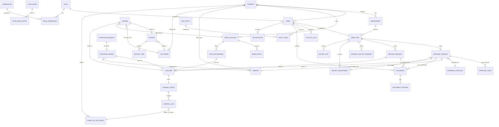

# Database Design Document (DDD)
## Expense & Finance Management System (EFMS)

**Document Version:** 1.0
**Database Engine:** PostgreSQL (via Prisma ORM)

---

## 1. Entity-Relationship Diagram (Core Entities)

*(`ANY_ENTITY` is a conceptual placeholder — the Audit Trail table is polymorphic, referenced via `entity_type` + `entity_id`.)*

---

## 2. Table Definitions

### 2.1 `companies`
| Column | Type | Constraints |
|---|---|---|
| id | UUID | PK |
| name | VARCHAR(255) | NOT NULL |
| gst_number | VARCHAR(20) | |
| logo_url | TEXT | |
| created_at | TIMESTAMP | NOT NULL DEFAULT now() |
| updated_at | TIMESTAMP | |

### 2.2 `users`
| Column | Type | Constraints |
|---|---|---|
| id | UUID | PK |
| company_id | UUID | FK → companies.id, NOT NULL |
| name | VARCHAR(255) | NOT NULL |
| email | VARCHAR(255) | UNIQUE, NOT NULL |
| password_hash | TEXT | NOT NULL |
| role_id | UUID | FK → roles.id, NOT NULL |
| is_2fa_enabled | BOOLEAN | DEFAULT false |
| is_active | BOOLEAN | DEFAULT true |
| last_login_at | TIMESTAMP | |
| created_at | TIMESTAMP | NOT NULL |

**Indexes:** `idx_users_company_id`, `idx_users_email` (unique)

### 2.3 `roles` / `permissions` / `role_permissions`
| Table | Key Columns |
|---|---|
| roles | id (PK), company_id (FK), name (Super Admin/Admin/HR/Accountant/Employee), is_system_role |
| permissions | id (PK), key (e.g., `expense.approve`), description |
| role_permissions | role_id (FK), permission_id (FK) — composite PK |

### 2.4 `departments` / `employees`
| Table | Key Columns |
|---|---|
| departments | id (PK), company_id (FK), name |
| employees | id (PK), company_id (FK), user_id (FK, nullable), department_id (FK), employee_code (UNIQUE per company), basic_salary (DECIMAL), joining_date |

### 2.5 `expense_categories`
| Column | Type | Constraints |
|---|---|---|
| id | UUID | PK |
| company_id | UUID | FK, NOT NULL |
| name | VARCHAR(100) | NOT NULL |
| is_custom | BOOLEAN | DEFAULT false |

### 2.6 `expense_requests`
| Column | Type | Constraints |
|---|---|---|
| id | UUID | PK |
| company_id | UUID | FK, NOT NULL |
| employee_id | UUID | FK → employees.id, NOT NULL |
| category_id | UUID | FK → expense_categories.id, NOT NULL |
| purpose | TEXT | NOT NULL |
| amount | DECIMAL(14,2) | NOT NULL, CHECK (amount > 0) |
| vendor_id | UUID | FK → vendors.id, NULLABLE |
| expected_date | DATE | |
| quotation_doc_id | UUID | FK → documents.id, NULLABLE |
| invoice_doc_id | UUID | FK → documents.id, NULLABLE |
| paid_by_employee | BOOLEAN | DEFAULT false |
| status | ENUM | (`draft`,`pending_manager`,`pending_admin`,`approved`,`rejected`,`verified`,`closed`) |
| created_at | TIMESTAMP | NOT NULL |

**Indexes:** `idx_expense_company_status`, `idx_expense_employee_id`

### 2.7 `approval_steps`
| Column | Type | Constraints |
|---|---|---|
| id | UUID | PK |
| entity_type | VARCHAR(50) | e.g. `expense_request`, `refund_request`, `purchase_request` |
| entity_id | UUID | NOT NULL |
| step_order | SMALLINT | NOT NULL |
| approver_role_id | UUID | FK → roles.id |
| approver_user_id | UUID | FK → users.id, NULLABLE (assigned at runtime) |
| status | ENUM | (`pending`,`approved`,`rejected`) |
| acted_at | TIMESTAMP | |

**Indexes:** `idx_approval_entity` (entity_type, entity_id)

### 2.8 `purchase_requests` / `purchase_orders`
| Table | Key Columns |
|---|---|
| purchase_requests | id (PK), company_id (FK), requested_by (FK employees), item_description, estimated_amount, status |
| purchase_orders | id (PK), purchase_request_id (FK), vendor_id (FK), po_number (UNIQUE, auto-generated), amount, status |

### 2.9 `vendors` / `customers`
| Table | Key Columns |
|---|---|
| vendors | id (PK), company_id (FK), name, gst_number, contact_info |
| customers | id (PK), company_id (FK), name, gst_number, contact_info |

### 2.10 `income`
| Column | Type | Constraints |
|---|---|---|
| id | UUID | PK |
| company_id | UUID | FK |
| source | ENUM | (Client Payment, AMC, Subscription, Consultancy, Software Dev, Website Dev, App Dev, Training, Other) |
| customer_id | UUID | FK → customers.id |
| invoice_id | UUID | FK → invoices.id, NULLABLE |
| payment_mode | ENUM | (Cash, Bank, UPI, Cheque, etc.) |
| bank_account_id | UUID | FK, NULLABLE |
| reference_no | VARCHAR(100) | |
| gst_amount | DECIMAL(14,2) | |
| amount | DECIMAL(14,2) | NOT NULL |
| remaining_amount | DECIMAL(14,2) | DEFAULT 0 |
| status | ENUM | (pending, partial, paid) |

### 2.11 `invoices` / `invoice_lines`
| Table | Key Columns |
|---|---|
| invoices | id (PK), company_id (FK), type (Quotation/Proforma/Tax/Receipt/CreditNote/DebitNote/PaymentReceipt), invoice_number (UNIQUE, auto-gen per type), customer_id (FK), gst_number, total_amount, pdf_url, signature_url, created_at |
| invoice_lines | id (PK), invoice_id (FK), description, qty, unit_price, line_total |

### 2.12 `vouchers`
| Column | Type | Constraints |
|---|---|---|
| id | UUID | PK |
| company_id | UUID | FK |
| type | ENUM | (Payment, Receipt, Journal, Contra, Refund, Salary, Advance, Expense) |
| voucher_number | VARCHAR(20) | UNIQUE per (company_id, type) — auto-generated, e.g. PV00001 |
| amount | DECIMAL(14,2) | NOT NULL |
| purpose | TEXT | |
| receiver | VARCHAR(255) | |
| given_by | UUID | FK → users.id |
| status | ENUM | (draft, issued, cancelled) |
| pdf_url | TEXT | |
| created_at | TIMESTAMP | |

**Indexes:** `idx_voucher_number` (unique, company_id + type + voucher_number)

### 2.13 `chart_of_accounts` / `journal_entries` / `journal_lines`
| Table | Key Columns |
|---|---|
| chart_of_accounts | id (PK), company_id (FK), code (UNIQUE per company), name, account_type (Asset/Liability/Income/Expense/Equity) |
| journal_entries | id (PK), company_id (FK), voucher_id (FK, NULLABLE), entry_date, description, created_by (FK users) |
| journal_lines | id (PK), journal_entry_id (FK), account_id (FK → chart_of_accounts.id), debit (DECIMAL), credit (DECIMAL), CHECK (debit=0 OR credit=0) |

**Constraint:** Sum(debit) = Sum(credit) per journal_entry_id, enforced at the application/service layer (and optionally via a DB trigger).

### 2.14 `refund_requests`
| Column | Type | Constraints |
|---|---|---|
| id | UUID | PK |
| company_id | UUID | FK |
| employee_id | UUID | FK |
| amount | DECIMAL(14,2) | NOT NULL |
| bill_doc_id | UUID | FK → documents.id |
| status | ENUM | (requested, verified, approved, paid, rejected) |
| voucher_id | UUID | FK → vouchers.id, NULLABLE |

### 2.15 `salary_adjustments` / `advance_salary_requests` / `salary_slips`
| Table | Key Columns |
|---|---|
| salary_adjustments | id (PK), employee_id (FK), expense_request_id (FK, NULLABLE), basic_salary, expense_amount, net_salary, period (month/year), created_at |
| advance_salary_requests | id (PK), employee_id (FK), amount, status, voucher_id (FK, NULLABLE), deduct_in_period |
| salary_slips | id (PK), employee_id (FK), period, gross, deductions, net_pay, pdf_url |

### 2.16 `bank_accounts` / `bank_entries`
| Table | Key Columns |
|---|---|
| bank_accounts | id (PK), company_id (FK), bank_name, account_number, current_balance |
| bank_entries | id (PK), bank_account_id (FK), type (credit/debit/transfer), amount, reference, entry_date |

### 2.17 `cash_book` / `cash_book_entries` / `cash_withdrawals`
| Table | Key Columns |
|---|---|
| cash_book | id (PK), company_id (FK), business_date (UNIQUE per company), opening_balance, closing_balance, cash_difference |
| cash_book_entries | id (PK), cash_book_id (FK), type (received/spent), amount, purpose, voucher_id (FK), done_by (FK users), approved_by (FK users) |
| cash_withdrawals | id (PK), bank_account_id (FK), amount, withdrawn_by (FK users), voucher_id (FK) |

### 2.18 `documents` / `document_versions`
| Table | Key Columns |
|---|---|
| documents | id (PK), company_id (FK), folder_path, name, type, file_url, uploaded_by (FK users), expiry_date, is_archived |
| document_versions | id (PK), document_id (FK), version_no, file_url, created_at |

**Indexes:** `idx_documents_folder`, `idx_documents_expiry`

### 2.19 `activity_logs`
| Column | Type | Constraints |
|---|---|---|
| id | UUID | PK |
| company_id | UUID | FK |
| user_id | UUID | FK |
| action | VARCHAR(100) | e.g. `login`, `expense.approve` |
| ip_address | VARCHAR(45) | |
| browser | VARCHAR(255) | |
| old_value | JSONB | |
| new_value | JSONB | |
| created_at | TIMESTAMP | NOT NULL |

**Indexes:** `idx_activity_user_date`, `idx_activity_action`

### 2.20 `audit_trail`
| Column | Type | Constraints |
|---|---|---|
| id | UUID | PK |
| entity_type | VARCHAR(50) | NOT NULL |
| entity_id | UUID | NOT NULL |
| changed_by | UUID | FK → users.id |
| old_value | JSONB | |
| new_value | JSONB | |
| reason | TEXT | |
| ip_address | VARCHAR(45) | |
| device | VARCHAR(255) | |
| created_at | TIMESTAMP | NOT NULL |

**Indexes:** `idx_audit_entity` (entity_type, entity_id) — **append-only, no UPDATE/DELETE grants at the DB role level**

### 2.21 `notifications`
| Column | Type | Constraints |
|---|---|---|
| id | UUID | PK |
| user_id | UUID | FK |
| channel | ENUM | (email, sms, whatsapp, push, in_app) |
| event_type | VARCHAR(50) | |
| payload | JSONB | |
| status | ENUM | (queued, sent, failed) |
| created_at | TIMESTAMP | |

### 2.22 `settings` / `backups`
| Table | Key Columns |
|---|---|
| settings | id (PK), company_id (FK), key, value (JSONB) |
| backups | id (PK), company_id (FK), type (db/document), file_url, status, created_at |

---

## 3. Relationships Summary

- `companies` is the tenant root; every business table carries `company_id` for tenant isolation.
- `expense_requests`, `refund_requests`, `purchase_requests` each drive an `approval_steps` chain (polymorphic via `entity_type` + `entity_id`).
- `vouchers` is the single point through which money-movement enters the books; every voucher has exactly one balanced `journal_entries` record.
- `journal_lines` always references `chart_of_accounts`, and the sum of debits must equal the sum of credits per entry.
- `audit_trail` and `activity_logs` are polymorphic/append-only and reference any entity by type + id.
- `documents` is referenced by multiple modules (expense quotations/invoices, refund bills, employee documents, company documents) via foreign keys or polymorphic association.

## 4. Indexing & Constraint Strategy

- All foreign keys are indexed.
- Composite uniqueness on voucher/invoice numbering: `(company_id, type, number)`.
- `CHECK` constraints enforce non-negative amounts and debit/credit exclusivity per journal line.
- Soft-delete (`is_archived BOOLEAN DEFAULT false`) on all financially/audit-relevant tables in place of hard deletes, per BR-18.
- Partial indexes on `status` columns for fast "pending approval" dashboard queries (e.g., `WHERE status = 'pending_admin'`).
- `JSONB` columns (old_value/new_value/payload) use GIN indexes where searched.

## 5. Data Retention & Backup

- Daily automated backup jobs (per SDD Section 6) dump PostgreSQL and sync the document bucket.
- Audit trail and activity logs are retained indefinitely (or per configured statutory retention period) and are never purged, only optionally moved to cold storage.
